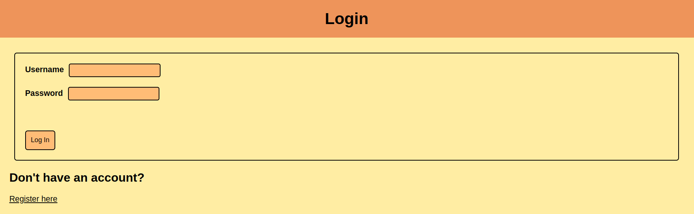

# EWPROJ

## 1 - Tema
Após analisarmos os diversos temas de trabalho, bem como os dados fornecidos e a maneira como os mesmos se encontravam dispostos, no momento de escolha optámos pelo tema das Inquirições de Génere. 
Este tema demonstrou-se também algo interessante uma vez que aprendemos um pouco mais sobre o Inquirições de Génere ao mesmo tempo que conseguimos aplicar o conhecimento adquirido ao longo da UC.

## 2 - Dataset e conversão para JSON
Para a conversão de dados, foi desenvolvido um script em Python que realiza a leitura do arquivo CSV, extrai e transforma as informações relevantes, e finalmente grava esses dados em um arquivo JSON. No desenvolvimento deste script foram importadas as bibliotecas `csv`, `json` e `re` para manipulação de arquivos CSV, criação do arquivo JSON e uso de expressões regulares para extração de dados, respetivamente.
Ao longo deste script foram implementadas algumas funções que, através do uso de expressões regulares permitem ir às diferentes colunas do ficheiro .csv que nos foi fornecido, recolhendo as informações necessárias na construção do ficheiro .json com que pretendemos trabalhar. 

## 3 - Importação e Docker

### Importação de Dados
Para a importação de dados, estes são importados sempre que se faz `docker-compose up --build` (visível no `docker-compose.yaml` mais abaixo). Para além disso, foi desenvolvida uma funcionalidade que permite o upload de ficheiros JSON através do frontend. Estes ficheiros são enviados para o backend, onde são processados e inseridos na base de dados MongoDB. Abaixo está o fluxo de importação:

1. **Upload do Ficheiro JSON**: Utilizadores podem fazer upload de um ficheiro JSON através de um formulário no frontend.
2. **Processamento no Backend**: O backend, utilizando `Express` e `Multer`, recebe o ficheiro, lê o seu conteúdo, e converte-o para um objeto JSON.
3. **Inserção no MongoDB**: O objeto JSON é então inserido na coleção apropriada na base de dados MongoDB.

### Docker
Para facilitar a implementação e execução do projeto, utilizámos a framework `Docker` para criar um ambiente isolado e consistente. O uso do Docker garante que todas as dependências e configurações estejam corretamente definidas, permitindo uma fácil replicação do ambiente de desenvolvimento e produção. 

#### Configuração do Docker
O projeto está configurado com um ficheiro `yaml`: `docker-compose.yml`, que define dois serviços principais: `frontend` e `backend`.

- **Frontend**: Serviço responsável pela interface do utilizador, desenvolvido com Express.js.
- **Backend**: Serviço que lida com a lógica de negócio e operações da base de dados, também desenvolvido com Express.js.

Abaixo está um exemplo simplificado do arquivo `docker-compose.yml`:

```yaml
services:
  backend:
    build:
      context: ./backend
      dockerfile: Dockerfile
    ports:
      - "3000:3000"
    depends_on:
      - mongodb
  frontend:
    build:
      context: ./frontend
      dockerfile: Dockerfile
    ports:
      - "3001:3001"
    depends_on:
      - backend
    volumes:
      - ./frontend/uploads:/EWPROJ/frontend/uploads
      - ./frontend/public/fileStore:/EWPROJ/frontend/public/fileStore
...

command: >
      sh -c '
        mongoimport --host mongodb -d genere -c genere --type json --file /db.json --jsonArray &&
        mongoimport --host mongodb -d genere -c users --type json --file /users.json --jsonArray &&
        mongoimport --host mongodb -d genere -c posts --type json --file /posts.json --jsonArray &&
        mongoimport --host mongodb -d genere -c suggestions --type json --file /suggestions.json --jsonArray
      '
```

#### Intruções para executar o Docker

1. Construir e Iniciar os Serviços:
```bash
docker-compose up --build
```
1. Em alternativa pode se executar o scrip `manage.sh`:
```bash
bash manage.sh [rebuild|start|remove]
``` 

2. Acessar o Frontend:
* Navegar para http://localhost:3001 no navegador para acessar a interface do utilizador.

3. Acessar o Backend:
* O backend estará disponível em http://localhost:3000.

## 4 - API

A API divide-se em 4 elementos: 
- **/** (index.js): onde são colocadas as rotas relativas às inquirições de génere.
- **/posts** (posts.js): onde são colocadas as rotas relativas aos posts.
- **/users** (user.js): onde são colocadas as rotas relativas aos utilizadores.
- **/suggestions** (suggestions.js) onde são colocadas as rotas relativas às sugestões de edição que os utilizadores podem fazer quanto aos registos.

### index.js
Neste ficheiro, são desenvolvidas as funções que permitem todo o tipo de `GET` necessários (todos os registos, registo individual, registos correspondentes a uma certa pesquisa, etc). Para além disso, também são desenvolvidas as funções que permitem a inserção de novos registos, a atualização de registos já existentes e a remoção de registos. Por fim, existem também funções que permitem fazer download ou funções que permitem obter ids (por exemplo, `router.get('/genereID')`, que devolve o maior id associado a um registo, garantiando que o id de um novo registo é sempre único).

### posts.js e suggestions.js
Tal como no ficheiro acima, as funções desenvolvidas nestes permitem que sejam feitas operações de `GET`, `POST`, `PUT` e `DELETE` em posts e sugestões. 

### user.js
Por fim,  o ficheiro user.js é um pouco diferente dos anteriores. Aqui, são desenvolvidas funções que permitem a autenticação e o registo de utilizadores. Para além disso, existem também funções cujo objetivo é verificar se um certo utilizador está autenticado e obter os detalhes de um certo utilizador, a partir do seu `token`.

Em resumo, a API conta com as seguintes rotas:

| Método | Rota | Descrição |
| ------ | ---- | --------- |
| GET | / | Devolve todos os registos |
| GET | /search | Devolve os registos que correspondem a uma certa pesquisa |
| GET | /sort | Devolve os registos ordenados por um certo campo |
| GET | /genereID | Devolve o maior id associado a um registo |
| GET | /allIids | Devolve todos os ids associados a um registo |
| GET | /download | Faz download de um ficheiro .csv com todos os registos |
| GET | /:id | Devolve o registo com o id especificado |
| POST | / | Insere um novo registo |
| DELETE | /:id | Remove o registo com o id especificado |
| PUT | /:id | Atualiza o registo com o id especificado |
| POST | upload-json | Dá upload a um novo ficheiro .json |
| GET | /posts | Devolve todos os posts |
| GET | /posts/postID | Devolve o maior id associado a um post |
| GET | /posts/commentID | Devolve o maior id associado a um comentário |
| GET | /possts/:id | Devolve o post com o id especificado |
| POST | /posts | Insere um novo post |
| POST | /posts/:id/add-comment/ | Adiciona um comentário a um post |
| DELETE | /posts/:id/delete-comment/:commentId | Remove o comentário com o id especificado |
| DELETE | /posts/:id | Remove o post com o id especificado |
| GET | /suggestions | Devolve todas as sugestões |
| GET | /suggestions/suggestionID | Devolve o maior id associado a uma sugestão |
| GET | /suggestions/:id | Devolve a sugestão com o id especificado |
| POST | /suggestions | Insere uma nova sugestão |
| DELETE | /suggestions/:id | Remove a sugestão com o id especificado |
| GET | /users | Verifica se um utilizador está autenticado |
| GET | /users/details | Devolve os detalhes de um utilizador (username e level)|
| POST | /users/register | Regista um novo utilizador |
| POST | /users/login | Autentica um utilizador |


## 5 - Frontend
No que toca ao frontend, o grupo focou-se em criar um programa funcional e simples. Desde a página inicial à dos posts, passando pelas de `registo` e `login`, a ideia foi sempre facilitar a vida ao utilizador. Seguidamente, mostramos algumas imagens do frontend.


A página de autenticação assemelha-se ao comum, permitindo ao user autenticar-se com o seu *username* e a sua *password*. Caso o user não tenha conta, pode sempre clicar no botão de registo, que o levará para a página de registo.


A página inicial é diferente conforme o utilizador seja um utilizador normal ou um administrador. Como se pode ver, o utilizador normal é capaz de aceder à página dos *posts*, fazer pesquisas, download do CSV, desconectar-se, ver os registos um-a-um e sugerir mudanças.


O administrador, para além de poder fazer tudo o que o utilizador normal faz, pode também adicionar novos registos, editar registos, eliminar registos, aceder à página de sugestões (onde pode aceitá-las ou recusá-las) e dar upload de ficheiros JSON (apesar de que estes ficam apenas guardados numa pasta, não são adicionados ao programa).


Por fim, é também relevante mostrar a página dos posts, em que é possível visualizar os posts. Os utilizadores normais podem também fazer novos posts e comentar posts já existentes.


Já os `admins`, nesta página, podem fazer tudo o que os utilizadores normais fazem, mas também podem eliminar posts e comentários.


## 7 - Conclusão

Este projeto permitiu o nosso desenvolvimento individual no trabalho com dados complexos, permitindo-nos organizar, apresentar e interagir com os dados de forma a alcançar o resultado final. 
Analisando o dataset fornecido e aplicando-lhe diversas técnicas de processamento de dados, fomos capazes de transformar dados "soltos" numa ferramenta de procura genealógica, desenvolvendo com ela uma interface web que permite tanto a inserção de novos elementos, bem como a edição e remoção dos mesmos, e outras funcionalidades (como a interação com as inquirições de génere já presentes no sistema).
Fazendo uma observação final ao trabalho, consideramo-nos satisfeitos com o resultado final tendo sido implementados com sucesso quase todos os objetivos propostos, faltando, por exemplo, a autenticação via `Google/Facebook` ou o upload de ficheiros diretamente para a base de dados. Mesmo assim, considerámos ainda a existência de uma margem de melhoria e a possibilidade de implementação de novas funcionalidades.  